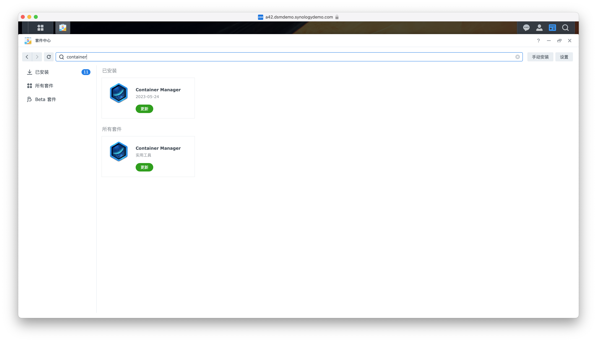

# 群晖 (DSM 7.2) 部署说明（ QNAP 同理）

在 DSM 7.2 中，已经支持了 Docker Compose，推荐使用 Docker Compose 一键部署本项目。

## 创建配置和数据存储文件夹


## 安装 Container Manager (Docker) 套件

进入套件中心，安装 Container Manager (Docker) 套件。

{data-zoomable}

## 通过 Docker compose 安装配置 AB

点击 **项目**，然后点击 **新建**，选择 **Docker Compose**。

{data-zoomable}

复制以下内容填入 **Docker Compose** 中。
```yaml
version: "3.8"

services:
  ab:
    image: "ghcr.io/estrellaxd/auto_bangumi:latest"
    container_name: "auto_bangumi"
    restart: unless-stopped
    ports:
      - "7892:7892"
    volumes:
      - "/volume1/docker/ab/config:/app/config"
      - "/volume1/docker/ab/data:/app/data"
      - "/volume1/docker/ab/log:/app/log"
```

点击 **下一步**，然后点击 **完成**。

{data-zoomable}

完成创建之后进入 `http://<NAS IP>:7892` 即可进入 AB 并进行配置。

## 通过 Docker compose 安装配置 AB 和 qBittorrent

在同时拥有代理和ipv6的情况下，群晖nas提供的docker配置ipv6极为复杂，推荐直接将AB和qBittorrent安装到host网络下，降低工作量。

以下内容的使用条件为：在docker上已经部署好了一个clash代理，并能够通过本地ip的指定端口进行访问。

参考上一节的内容，将以下内容经过调整填入 **Docker Compose** 中。

```yaml
version: "3.2"
services:
  qbittorrent:
    container_name: qBittorrent
    environment:
      - TZ=Asia/Shanghai
      - TemPath=/downloads
      - SavePath=/downloads
      - PGID=1000  #需要自行修改填入
      - PUID=1000  #需要自行修改填入
      - WEBUI_PORT=8080  #建议自行修改端口号
    volumes:
      - /volume1/docker/qb/config:/config
      - /volume1/docker/qb/downloads:/downloads # 填入下载路径
    ports:
      - 8080:8080  # 建议自行修改端口号
      - "6881:6881"
      - "6881:6881/udp"
    network_mode:
      host
    restart: unless-stopped
    image: superng6/qbittorrent

  auto_bangumi:
    container_name: AutoBangumi
    environment:
      - TZ=Asia/Shanghai
      - PGID=1000  #需要自行修改填入
      - PUID=1000  #需要自行修改填入
      - AB_DOWNLOADER_HOST=127.0.0.1:8080  #建议自行修改端口号
    volumes:
      - /volume1/docker/ab/config:/app/config
      - /volume1/docker/ab/data:/app/data
    network_mode:
      host
    ports:
      - '7892:7892'
    dns:
      - 8.8.8.8
      - 223.5.5.5
    restart: unless-stopped
    image: estrellaxd/auto_bangumi:latest
    depends_on:
      - qbittorrent

```

其中的PGID与PUID需要自行寻找，群晖的新nas通常应该是：`PUID=1026,PGID=100`，qbittorrent对应的端口号在修改时注意保证所有位置全部修改完成。

启动后在AB和qB的设置页里找到代理，AB的话**sock5**和**http**均可，qB建议使用**http**（sock5有bug，有可能连不上），如果clash是可以通过NAS的ip地址访问的话，直接将地址填写为127.0.0.1，端口看自己设置，不勾选**使用代理服务器进行用户连接**，勾选**只对torrent使用代理**和**使用代理进行主机名查询**。通常机场是不允许bt下载的，在勾选这两个选项后，qB只会在获取RSS以及查询tracker服务器时经过代理，再加上飞机通常都会加入规则来过滤下载的请求，这样的话机场账号被封禁的概率应该就很小了（当然解释权在机场手里）

由于群晖NAS性能问题，默认的配置很大概率会出现**cpu占用爆满**，AB无法链接qB且qB的WebUI无法正常登陆的情况，并带来各种各样的bug。~~（你一口气下了太多番剧，要塞不下了啊\~）~~ 实际上220+在直接加入一部12集的完结番时就会出现这种情况 ~~（比方说跃动青春，害得我整个容器重做）~~

以220+为例，qB参考配置如下，主要就是减少下载与上传的连接数，这个会极大的影响qB的cpu占用。

> 链接
>> 链接限制
>>> 全局最大连接数: 300
>>> 
>>> 每torrent最大连接数: 60
>>>
>>> 全局上传窗口数上限: 15
>>>
>>> 每个torrent上传窗口数上限: 4
>>
> BitTorrent
>> 最大活跃检查种子数 1
>> Torrent排队
>>> 最大活动的下载数: 3
>>>
>>> 最大活动的上传数: 5
>>>
>>> 最大活动的torrent数: 10
>>>
> RSS
>> RSS阅读器
>>> 每个订阅源文章数目最大值: 50

